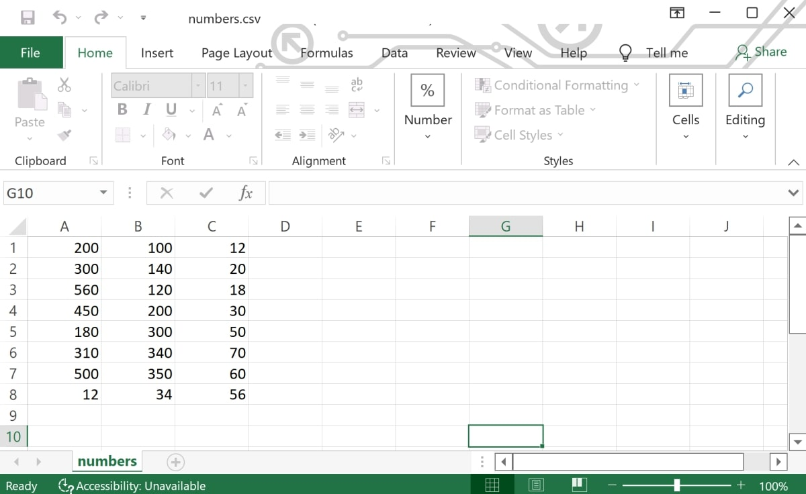
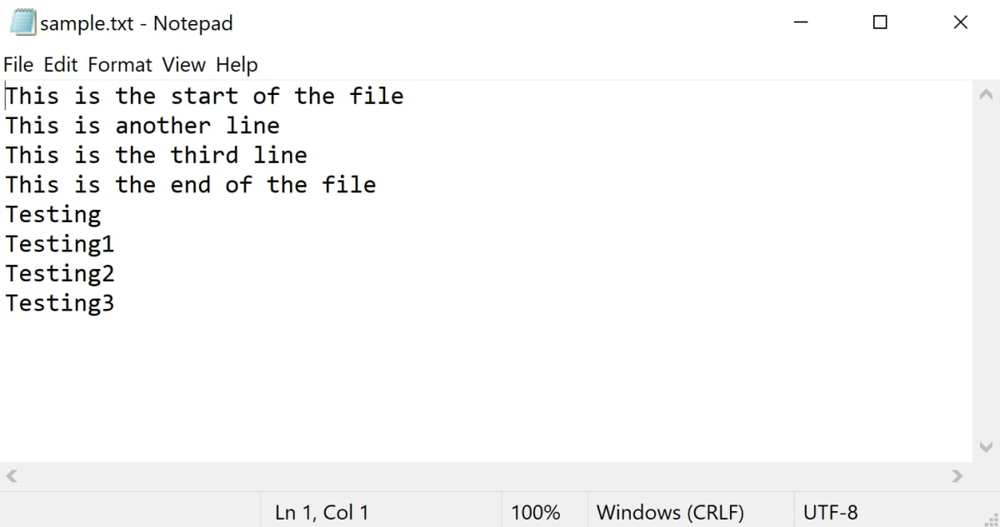

# Read-and-write-files-using-JES
This is an example of how to read and write text and CSV files in JES.

## Prerequisites 

* Make sure you have JES installed on your computer.

## To Run

* Open the JES Program.
* Click on File > open program and open the Example/files.py file
* Load the program
* Run the readFromFile() and writeToFile() functions using the command line
* The example txt and CSV files are inside the Files folder 

## Example

